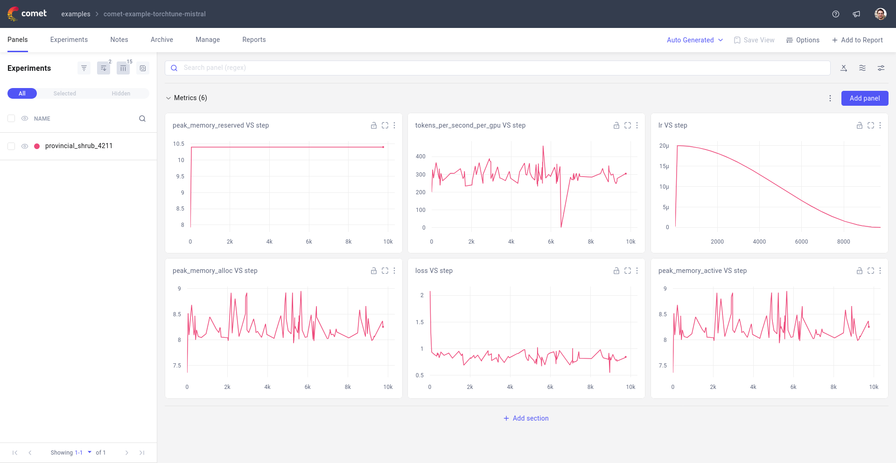

.. _comet_logging:

================
Logging to Comet
================

This deep-dive will guide you through how to set up logging to Comet in torchtune.

.. grid:: 1

    .. grid-item-card:: :octicon:`mortar-board;1em;` What this deep-dive will cover

      * How to get started with Comet
      * How to use the :class:`~torchtune.training.metric_logging.CometLogger`
      * How to log configs, metrics, and model checkpoints to Comet

torchtune supports logging your training runs to `Comet <https://www.comet.com/site/?utm_source=torchtune&utm_medium=docs&utm_content=docs>`_.
An example Comet workspace from a torchtune fine-tuning run can be seen in the screenshot below.

.. note::

  You will need to install the :code:`comet_ml` package to use this feature.
  You can install it via pip:

  .. code-block:: bash

    pip install comet_ml

  You will also likely need to login to Comet in order to start logging data. You can do it through the command line with:

  .. code-block:: bash

    comet login

Metric Logger
-------------

The only change you need to make is to add the metric logger to your config. Comet will log the metrics and model checkpoints for you.

.. code-block:: yaml

    # enable logging to the built-in CometLogger
    metric_logger:
      _component_: torchtune.training.metric_logging.CometLogger
      # the Comet project to log to
      project: comet-examples-torchtune
      experiment_name: my-experiment-name

We automatically grab the config from the recipe you are running and log it to Comet. You can find it in the Comet Hyperparameters tab and the actual file in the :code:`Assets & Artifacts` tab.

.. note::

  Click on this sample `Comet project to see the logged metrics after fine-tuning <https://www.comet.com/examples/comet-example-torchtune-mistral/>`_.
  The config used to train the models can be found `here <https://www.comet.com/examples/comet-example-torchtune-mistral/fffb3036880e41b5af2df932db4d3578?experiment-tab=params>`_.
