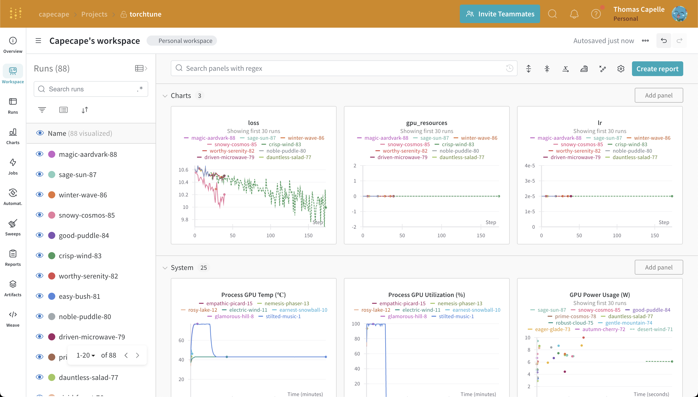

.. _wandb_logging:

===========================
Logging to Weights & Biases
===========================

This deep-dive will guide you through how to set up logging to Weights & Biases
(W&B) in torchtune.

.. grid:: 1

    .. grid-item-card:: :octicon:`mortar-board;1em;` What this deep-dive will cover

      * How to get started with W&B
      * How to use the :class:`~torchtune.training.metric_logging.WandBLogger`
      * How to log configs, metrics, and model checkpoints to W&B

torchtune supports logging your training runs to `Weights & Biases <https://wandb.ai)>`_.
An example W&B workspace from a torchtune fine-tuning run can be seen in the screenshot below.

.. note::

  You will need to install the :code:`wandb` package to use this feature.
  You can install it via pip:

  .. code-block:: bash

    pip install wandb

  Then you need to login with your API key using the W&B CLI:

  .. code-block:: bash

    wandb login

Metric Logger
-------------

The only change you need to make is to add the metric logger to your config. Weights & Biases will log the metrics and model checkpoints for you.

.. code-block:: yaml

    # enable logging to the built-in WandBLogger
    metric_logger:
      _component_: torchtune.training.metric_logging.WandBLogger
      # the W&B project to log to
      project: torchtune

We automatically grab the config from the recipe you are running and log it to W&B. You can find it in the W&B overview tab and the actual file in the :code:`Files` tab.

As a tip, you may see straggler `wandb` processes running in the background if your job crashes or otherwise exits without cleaning up resources. To kill these straggler processes, a command like ``ps
-aux | grep wandb | awk '{ print $2 }' | xargs kill`` can be used.

.. note::

  Click on this sample `project to see the W&B workspace <https://wandb.ai/capecape/torchtune>`_.
  The config used to train the models can be found `here <https://wandb.ai/capecape/torchtune/runs/6053ofw0/files/torchtune_config_j67sb73v.yaml>`_.

Logging Model Checkpoints to W&B
--------------------------------

You can also log the model checkpoints to W&B by modifying the desired script :code:`save_checkpoint` method.

A suggested approach would be something like this:

.. code-block:: python

    def save_checkpoint(self, epoch: int) -> None:
        ...
        ## Let's save the checkpoint to W&B
        ## depending on the Checkpointer Class the file will be named differently
        ## Here is an example for the full_finetune case
        checkpoint_file = Path.joinpath(
            self._checkpointer._output_dir, f"torchtune_model_{epoch}"
        ).with_suffix(".pt")
        wandb_at = wandb.Artifact(
            name=f"torchtune_model_{epoch}",
            type="model",
            # description of the model checkpoint
            description="Model checkpoint",
            # you can add whatever metadata you want as a dict
            metadata={
                training.SEED_KEY: self.seed,
                training.EPOCHS_KEY: self.epochs_run,
                training.TOTAL_EPOCHS_KEY: self.total_epochs,
                training.MAX_STEPS_KEY: self.max_steps_per_epoch,
            }
        )
        wandb_at.add_file(checkpoint_file)
        wandb.log_artifact(wandb_at)
